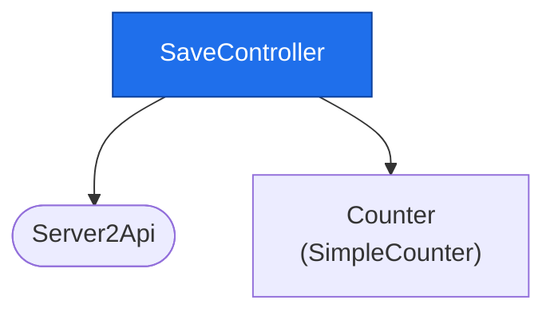

# DI Design Graph — client-server

> GENERATED by `nx run client-server:di-graph-generate` — do not edit by hand.
> Machine-readable version: [design.json](./design.json)

Each section below is one root's dependency tree: Level 0 is the root
(a `@Controller` or top-of-DAG class), and constructor injections fan
downward through Levels 1, 2, … A dependency shared by multiple roots
appears in each root's tree.

## PublicController — controller, Level 0…0

## SaveController — controller, Level 0…1

Edges are constructor/`inject()` dependencies (the injected param/field
name and token are in `design.json`). Rounded nodes are
`toConstantValue`/`useValue` and `toDynamicValue`/`useFactory` leaves; dashed
nodes are tokens the analyzer could not resolve.
