# Runtime viewer parity verification

Issue [#1185](https://github.com/deanhiller/webpieces-ts/issues/1185).
The runtime viewer and dependency viewer now share the drawer, modes, staged facets,
Focus/Lock controls, overlays, and floating navigation. Runtime adapters preserve
transport shapes and saved call-depth while using saved project metadata for modes.

These screenshots were captured with Chromium opening generated HTML via `file://`.
The client text is compiled from the source TypeScript, with the pinned Viz UMD renderer.
Browser fixtures isolate local sidecars so concurrent suites cannot overwrite each other.

| Surface | Dependency viewer | Runtime viewer |
| --- | --- | --- |
| Shell and Focus | 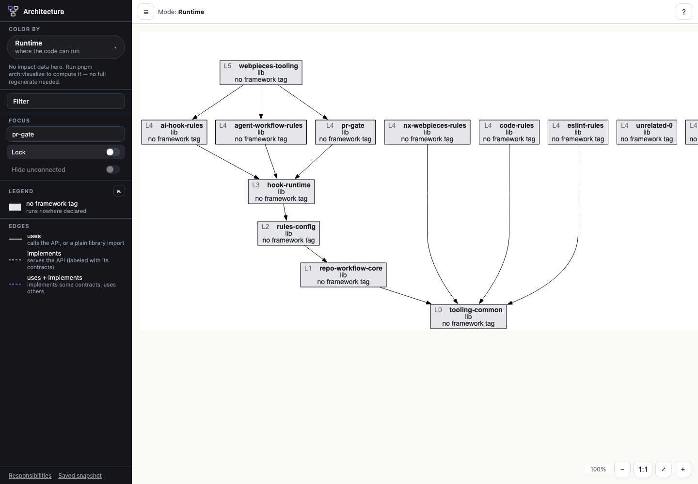 | 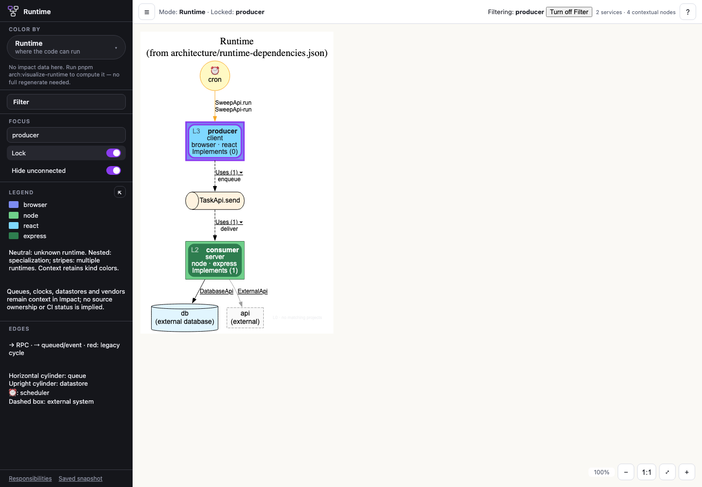 |
| Color menu | 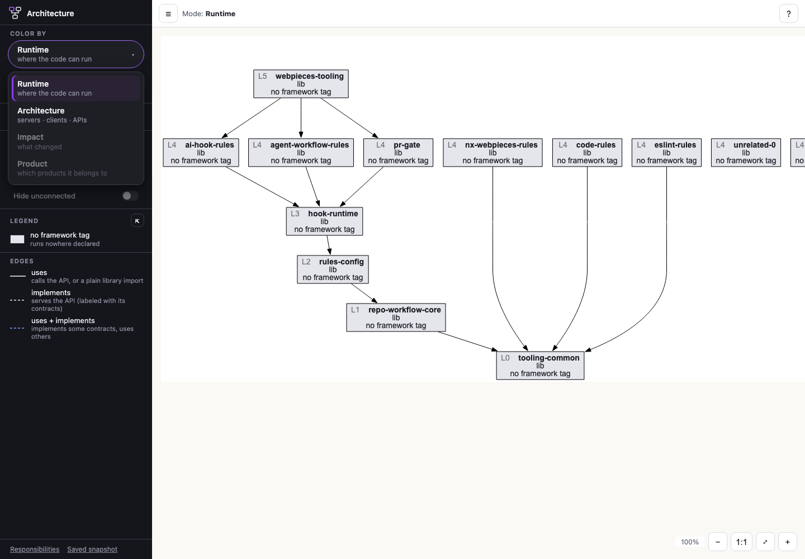 | 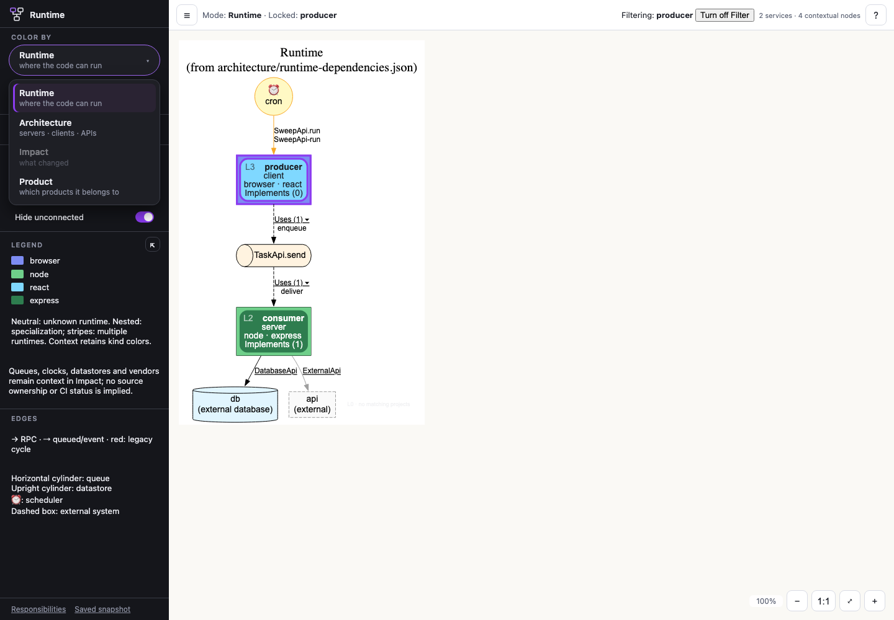 |
| Legend pop-out | 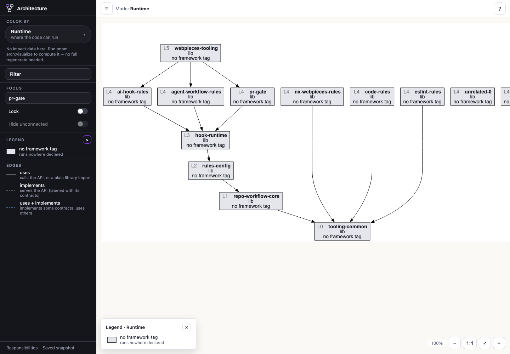 | 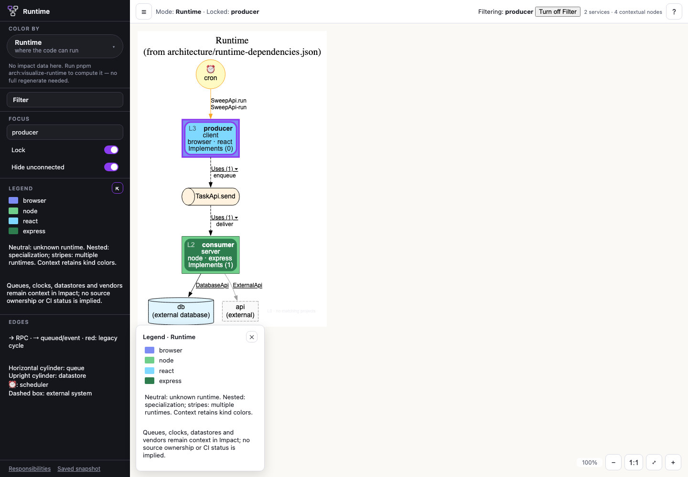 |
| Help | 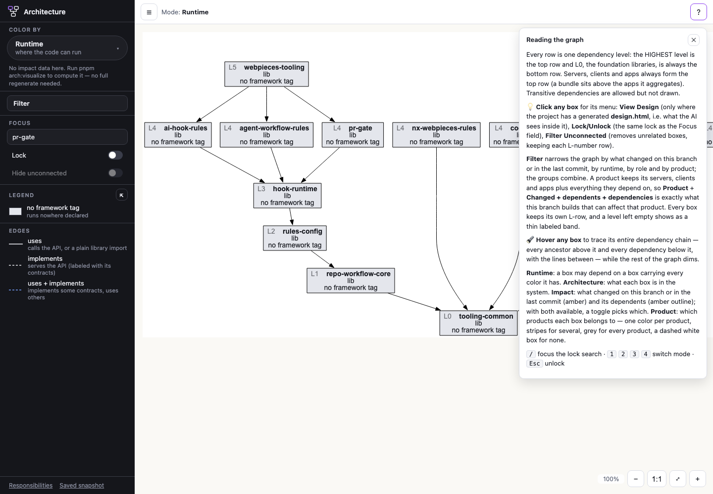 | 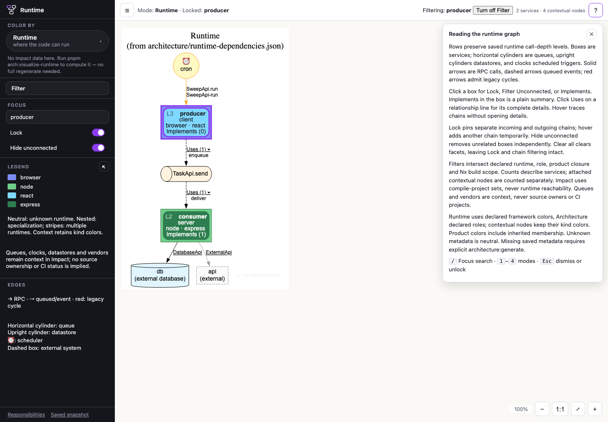 |
| Responsibilities | 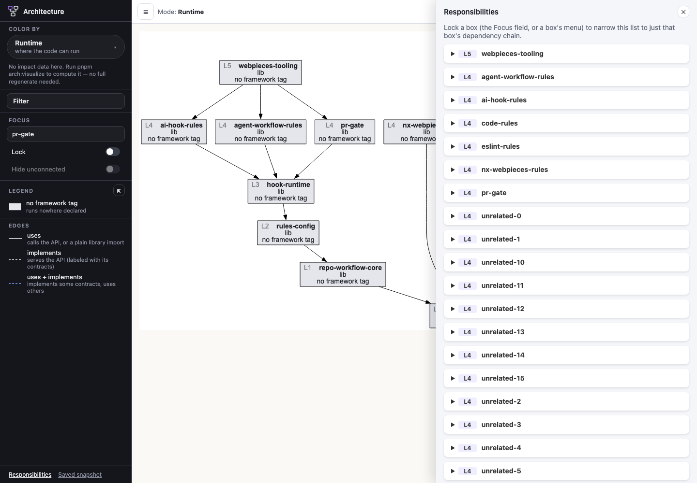 | 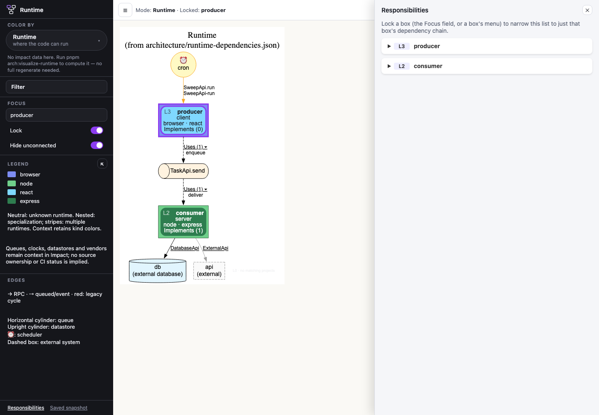 |

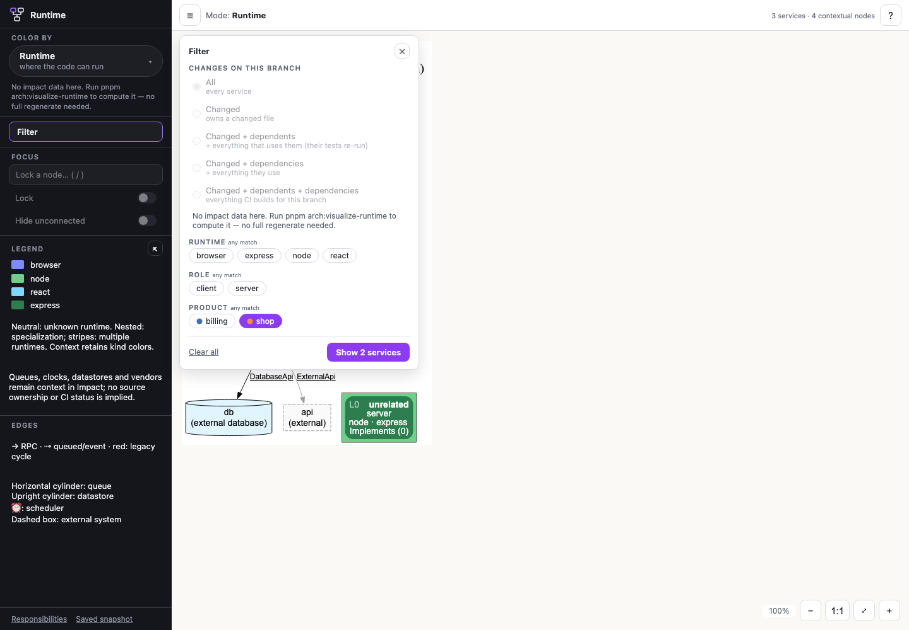
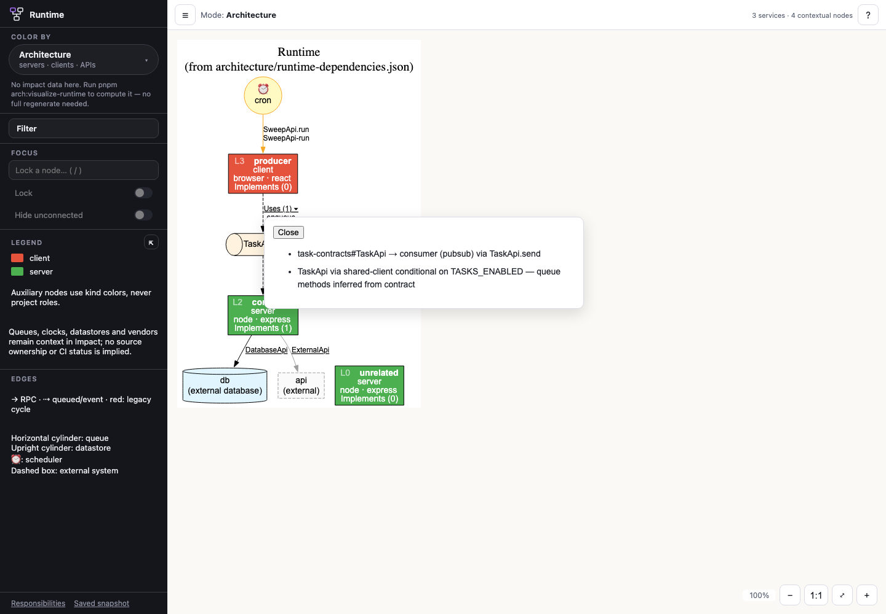
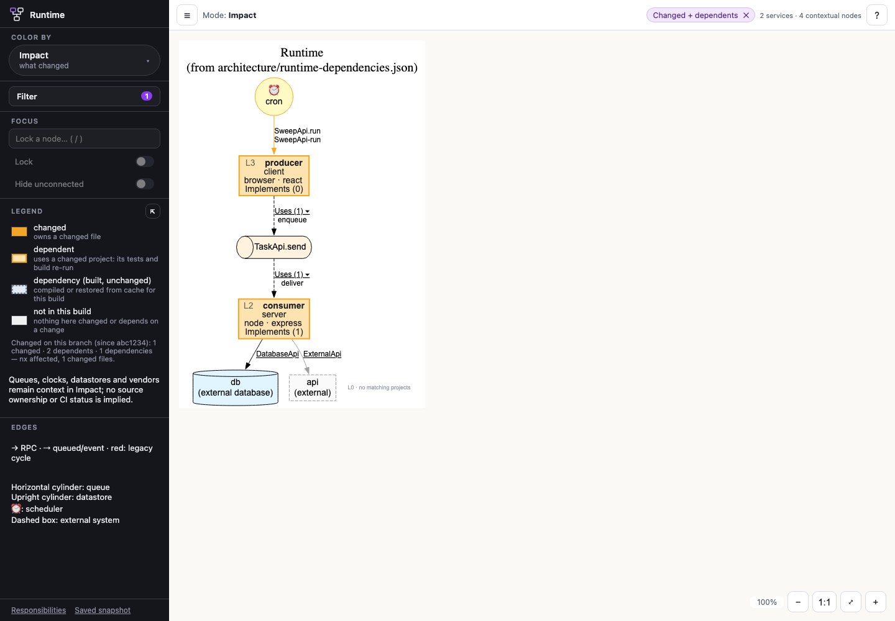
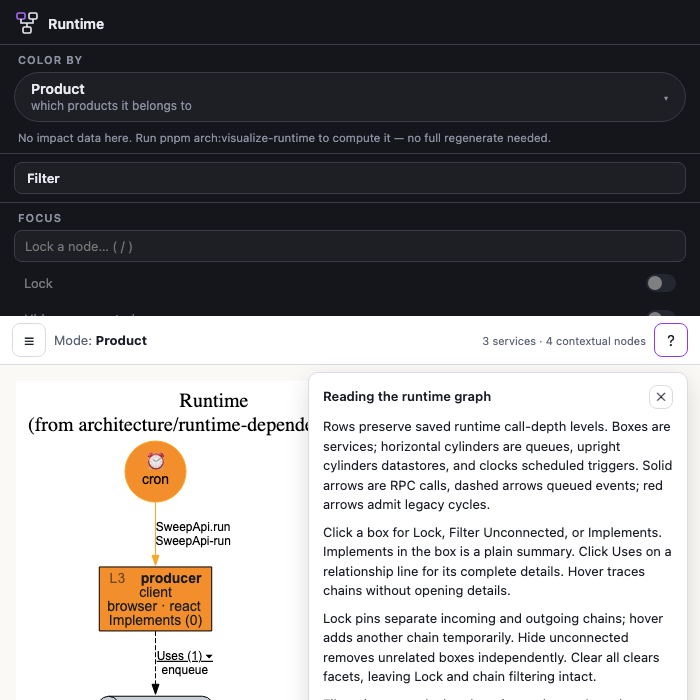
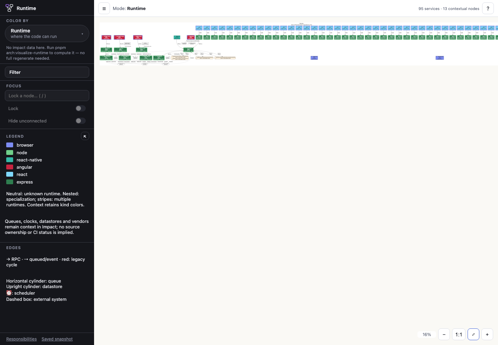

The focused browser suites cover draft/apply/cancel/clear, zero matches, service/context
counts, product closure, chain filtering, suspended Lock, hover union, both sidebar
switches, keyboard input, menus, details, redraws, narrow layouts and local-file loading.
The shared Impact suites cover feature/fresh/main/detached comparisons and unavailable
facts. Runtime projection explicitly tests a changed shared library affecting multiple
services while queues/vendors retain context styling. Unit adapters verify scoped IDs,
unknown legacy metadata, original levels, and hidden nodes.

A large case uses 15 services from an existing saved graph plus forty client→service
pairs (95 services total). The observed initial render was 314 ms and filter apply was
90 ms on this developer machine. These are observations, not a performance guarantee;
filter timing includes the synchronous SVG replacement.

Runtime-specific choices: auxiliary entities retain kind colors in Runtime, Architecture
and Impact; Product recolors them from inherited memberships without changing shapes.
Missing responsibility documents display explicit empty prose. No snapshot metadata is
invented or silently regenerated. Runtime viewing writes HTML/DOT and optional local
Impact facts under `tmp/webpieces`; issue #1169's dependency-output migration remains
separate work.
