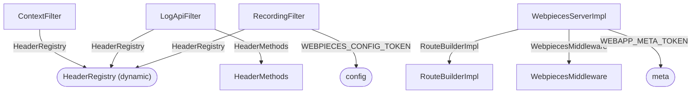

# DI Design Graph — http-server

> GENERATED by `nx run http-server:di-graph-generate` — do not edit by hand.
> Machine-readable version: [design.json](./design.json)

Edges are constructor injections: `-->|TOKEN|` for `@inject`/`@multiInject`,
unlabeled arrows for inject-by-type. Rounded nodes are `toConstantValue`/
`toDynamicValue` leaves; dashed nodes are tokens the analyzer could not resolve.
