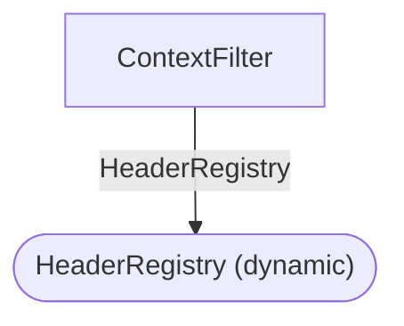
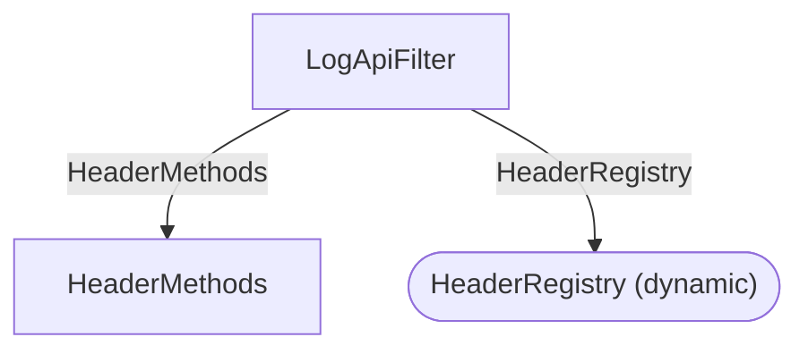
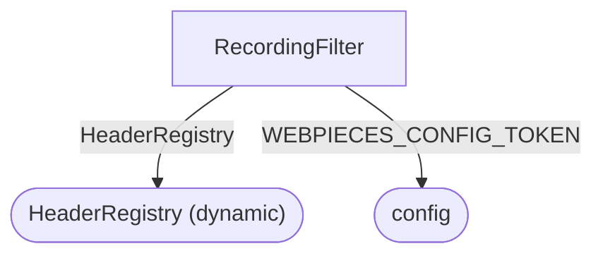
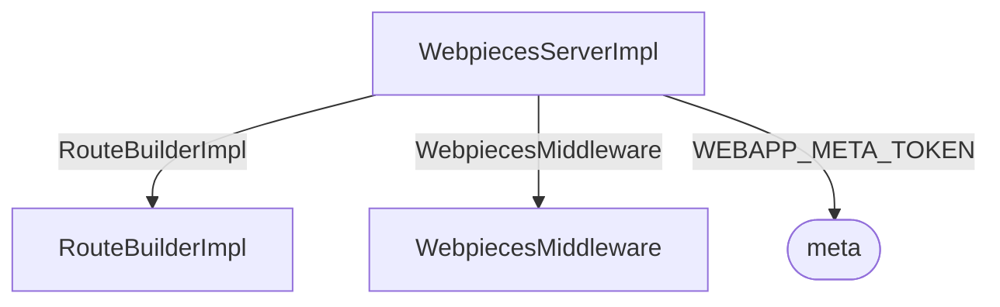

# DI Design Graph — http-server

> GENERATED by `nx run http-server:di-graph-generate` — do not edit by hand.
> Machine-readable version: [design.json](./design.json)

Each section below is one root's dependency tree: Level 0 is the root
(a `@Controller` or top-of-DAG class), and constructor injections fan
downward through Levels 1, 2, … A dependency shared by multiple roots
appears in each root's tree.

## ContextFilter — root, Level 0…1

## LogApiFilter — root, Level 0…1

## RecordingFilter — root, Level 0…1

## WebpiecesServerImpl — root, Level 0…1

Edges are constructor injections: `-->|TOKEN|` for `@inject`/`@multiInject`,
unlabeled arrows for inject-by-type. Rounded nodes are `toConstantValue`/
`toDynamicValue` leaves; dashed nodes are tokens the analyzer could not resolve.
