# DI Design Graph — pr-gate

> GENERATED by `nx run pr-gate:di-graph-generate` — do not edit by hand.
> Machine-readable version: [design.json](./design.json)

Each section below is one root's dependency tree: Level 0 is the root
(a `@DocumentDesign` or top-of-DAG class), and constructor injections fan
downward through Levels 1, 2, … A dependency shared by multiple roots
appears in each root's tree.

## PrGateApp — controller, Level 0…7

```mermaid
graph TD
    AiBranchName["AiBranchName"]
    BranchMutationLog["BranchMutationLog"]
    BranchNaming["BranchNaming"]
    BranchReaper["BranchReaper"]
    BuildAffected["BuildAffected"]
    CleanTmp["CleanTmp"]
    CleanupCommand["CleanupCommand"]
    Dashboard["Dashboard"]
    FinishUpdateCommand["FinishUpdateCommand"]
    FinishUpsertPrCommand["FinishUpsertPrCommand"]
    ForkPoint["ForkPoint"]
    GatherInfo["GatherInfo"]
    GitExec["GitExec"]
    MergeEnd["MergeEnd"]
    MergeStart["MergeStart"]
    MergeState["MergeState"]
    MergedBranchesService["MergedBranchesService"]
    OpenPrCheck["OpenPrCheck"]
    PrGateApp["PrGateApp"]:::controller
    RepoRootFinder["RepoRootFinder"]
    RunUpdate["RunUpdate"]
    StartUpdateCommand["StartUpdateCommand"]
    StartUpsertPrCommand["StartUpsertPrCommand"]
    WorktreeService["WorktreeService"]
    AiBranchName --> BranchNaming
    BranchReaper --> BranchMutationLog
    BranchReaper --> MergedBranchesService
    CleanTmp --> RepoRootFinder
    CleanupCommand --> BranchReaper
    CleanupCommand --> RepoRootFinder
    FinishUpdateCommand --> AiBranchName
    FinishUpdateCommand --> MergeEnd
    FinishUpdateCommand --> MergeState
    FinishUpdateCommand --> RepoRootFinder
    FinishUpsertPrCommand --> AiBranchName
    FinishUpsertPrCommand --> BranchNaming
    FinishUpsertPrCommand --> BuildAffected
    FinishUpsertPrCommand --> Dashboard
    FinishUpsertPrCommand --> GitExec
    FinishUpsertPrCommand --> MergeEnd
    FinishUpsertPrCommand --> MergeState
    FinishUpsertPrCommand --> RepoRootFinder
    ForkPoint --> AiBranchName
    ForkPoint --> MergeState
    ForkPoint --> RepoRootFinder
    GatherInfo --> AiBranchName
    GatherInfo --> ForkPoint
    GatherInfo --> GitExec
    GatherInfo --> MergeState
    GatherInfo --> RepoRootFinder
    GitExec --> RepoRootFinder
    MergeEnd --> BranchNaming
    MergeEnd --> CleanTmp
    MergeEnd --> GitExec
    MergeEnd --> MergeState
    MergeStart --> BranchNaming
    MergeStart --> GatherInfo
    MergeStart --> GitExec
    MergeStart --> MergeState
    MergedBranchesService --> WorktreeService
    OpenPrCheck --> BranchNaming
    PrGateApp --> CleanupCommand
    PrGateApp --> FinishUpdateCommand
    PrGateApp --> FinishUpsertPrCommand
    PrGateApp --> StartUpdateCommand
    PrGateApp --> StartUpsertPrCommand
    RunUpdate --> AiBranchName
    RunUpdate --> MergeEnd
    RunUpdate --> MergeStart
    RunUpdate --> MergeState
    StartUpdateCommand --> OpenPrCheck
    StartUpdateCommand --> RepoRootFinder
    StartUpdateCommand --> RunUpdate
    StartUpsertPrCommand --> AiBranchName
    StartUpsertPrCommand --> BranchNaming
    StartUpsertPrCommand --> BuildAffected
    StartUpsertPrCommand --> GitExec
    StartUpsertPrCommand --> RepoRootFinder
    StartUpsertPrCommand --> RunUpdate
    classDef controller fill:#1f6feb,color:#ffffff,stroke:#0d419d
    classDef apiImpl fill:#0d9488,color:#ffffff,stroke:#0f766e
    classDef component fill:#2da44e,color:#ffffff,stroke:#1a7f37
    classDef unresolved fill:#f0ad4e,color:#000000,stroke:#b8860b,stroke-dasharray: 5 5
    classDef external fill:#b39ddb,color:#000000,stroke:#5e35b1,stroke-width:3px
    classDef api fill:#4fc3f7,color:#000000,stroke:#0277bd,stroke-width:3px
    classDef many fill:#eceff1,color:#000000,stroke:#546e7a,stroke-width:2px,stroke-dasharray: 4 2
```

Edges are constructor/`inject()` dependencies (the injected param/field
name and token are in `design.json`). Rounded nodes are
`toConstantValue`/`useValue` and `toDynamicValue`/`useFactory` leaves; dashed
nodes are tokens the analyzer could not resolve; double-bordered nodes are
boundaries shown but not expanded: violet = a class from a published package
outside this workspace; cyan = a generated API-client proxy (`createApiClient`),
i.e. a service/network boundary whose remote impl lives in another process.
